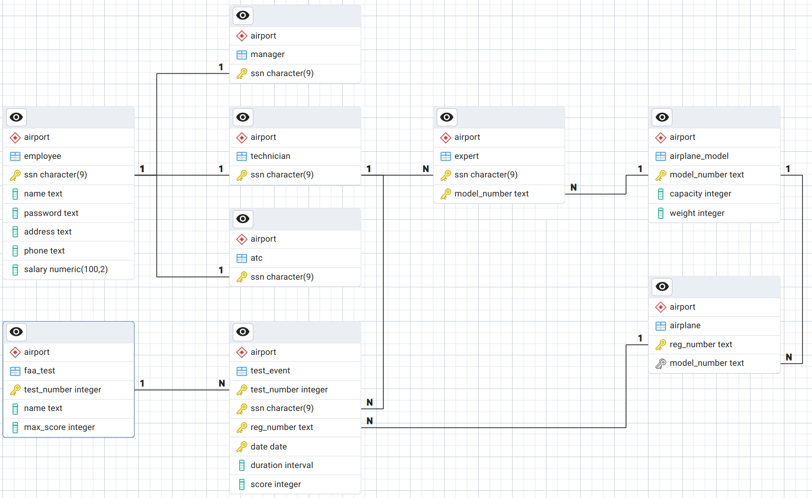

= CS 430 - Database Systems

== Download

You can download the project files here!

== Project - Airport

This assignment's goal is to gain hands-on experience with *PostgreSQL*, *ODBC*, and *JDBC*. The project is based on the airport scenario introduced in *Assignment 1*.

In this assignment, we introduce *managers* as a new *disjoint specialization* of *employees*. Managers use a *web application* to manage *employees*, *airplanes*, and view *airplane test results*, while *technicians* use a *standalone application* to record *airplane tests*.

You will develop a database-driven airport management system by implementing the database schema and integrating it with two applications:

* A *web-based management application* (Python + Flask + ODBC/PostgreSQL)
* An *airplane test application* (Java + JDBC/PostgreSQL)

This assignment consists of three main parts:

* *Database Setup*: Implement a PostgreSQL database based on the provided relational model _(20 points)_.
* *Python Web-Based Application*: Complete the database integration for the web-based management system using ODBC _(50 points)_.
* *Java Application*: Complete the database integration for the Java application using JDBC _(30 points)_.

You are given incomplete code for the Python and Java applications. If the ODBC/JDBC/PostgreSQL integration and SQL queries are correctly implemented, both applications should work *without modifications to the HTML templates or Python/Java code logic*. The source files `manager_app.py` and `AirplaneTestApp.java` have comments with instructions on where to add/modify code.

== Part 1: Database Implementation in PostgreSQL

=== Tasks:
* Create the PostgreSQL database using the provided relational model (figure above).
* Define the tables, primary keys, and foreign keys.
* Ensure all required constraints (e.g., `NOT NULL`, `CHECK`, `UNIQUE`, `FOREIGN KEY`) are correctly implemented.
* Implement at least *one stored procedure* to enforce a business rule at the database level.

*Deliverable:*
Submit an SQL script (`create_database.sql`) containing all the SQL commands to define the database and at least *one stored procedure* to implement a business rule. The script should not populate the database with data.

== Part 2: Web Management Application

You will complete the missing *ODBC/PostgreSQL integration* in a *Python Flask web application*.

=== Tasks:
* Implement the PostgreSQL connection using ODBC.
* Update the necessary tables to have a manager that can access the Flask application. Passwords should be stored as SHA-256 hashes (check out the example in ``password.py``).
* Write SQL queries for:
 ** Adding, updating, and deleting employees.
 ** Updating salaries and technicians' expertise.
 ** Managing airplane models and airplanes.
 ** Managing FAA test details.
 ** Viewing airworthiness tests recorded by technicians.
* Ensure updates only modify non-empty fields.
* Ensure deletions check for foreign key dependencies before removal.

*Deliverable:*
Submit a Python script (`manager_app.py`) with complete database integration.

== Part 3: Airplane Test Recording Application

You will complete the missing *JDBC/PostgreSQL integration* in a *Java application* that allows technicians to:

* Login using their credentials.
* Select an airplane and FAA test.
* Record a test event with date, duration, and score.

=== Tasks:
* Implement the PostgreSQL connection using JDBC in Java.
* Write SQL queries for:
 ** Technician authentication using hashed passwords (`SHA-256`).
 ** Fetching airplane and FAA test lists.
 ** Inserting new test events.

*Deliverable:*
Submit a Java file (`AirportTestApp.java`) with complete database integration.

== Grading

Your project will be graded based on the correctness of your database implementation and the functionality of the applications.

* The `create_database.sql` script will be executed, and the resulting database will be compared with the relational model.

* We will check the use of at least one **stored procedure**.

* An automated tool will be used to run both the Flask and Java applications and test their functionality, checking if they execute without errors and correctly interact with the database.

== Instructions

To run the applications, you have two options: you can either run them remotely using the CS department's Linux machines or locally on your machine.

=== Running Remotely

You need remote access to the Linux machines in the CS department. If you have never accessed them remotely, refer to the following guides:

* https://sna.cs.colostate.edu/remote-connection/vpn/
* https://sna.cs.colostate.edu/remote-connection/ssh/
* https://sna.cs.colostate.edu/remote-connection/gui/

==== Running the Flask app

Once you have SSH access and have copied the project files to the remote machine, navigate to the project directory and execute the following:

 python management_app.py

The Flask application will start and listen on port `5000`.

To access it *locally from your machine*, you must tunnel the remote port `5000` to your local port `5000`. To do so, run the following command on *your local machine*:

 ssh -N -L 5000:localhost:5000 username@machine.cs.colostate.edu

Where *username* is your *CSUID* and *machine* is the hostname of a CS department Linux machine. Now, you can access the Flask application using your local browser:

 http://127.0.0.1:5000

==== Running the Java app

To run the Java app remotely, you need to open a remote desktop session and start the application from the terminal by executing the following:

 java -cp .:postgresql-42.7.5.jar AirplaneTestApp.java

=== Running Locally

If you prefer to run the applications locally, set up a Python virtual environment and install *Flask* and *pyodbc* to run the Flask application. Also, make sure Java is installed to run the Java app. You also need to install and set up the required *PostgreSQL ODBC driver* to work with *pyodbc*. The project files already include the PostgreSQL JDBC Driver.

Then, from your activated Python virtual environment, execute the following command to run the Flask app:

 python management_app.py

You should be able to access the Flask application using your local browser:

 http://127.0.0.1:5000

To compile and run the Java app:

 java -cp .:postgresql-42.7.5.jar AirplaneTestApp.java

In order for the applications to access the database on `faure.cs.colostate.edu`, you need to tunnel the remote port to the local port by executing the following command:

 ssh -N -L 5432:localhost:5432 username@faure.cs.colostate.edu

Where *username* is your CSUID. This command forwards the local port `5432` to the remote database server, allowing both applications to connect to PostgreSQL as if running locally on localhost:5432.
